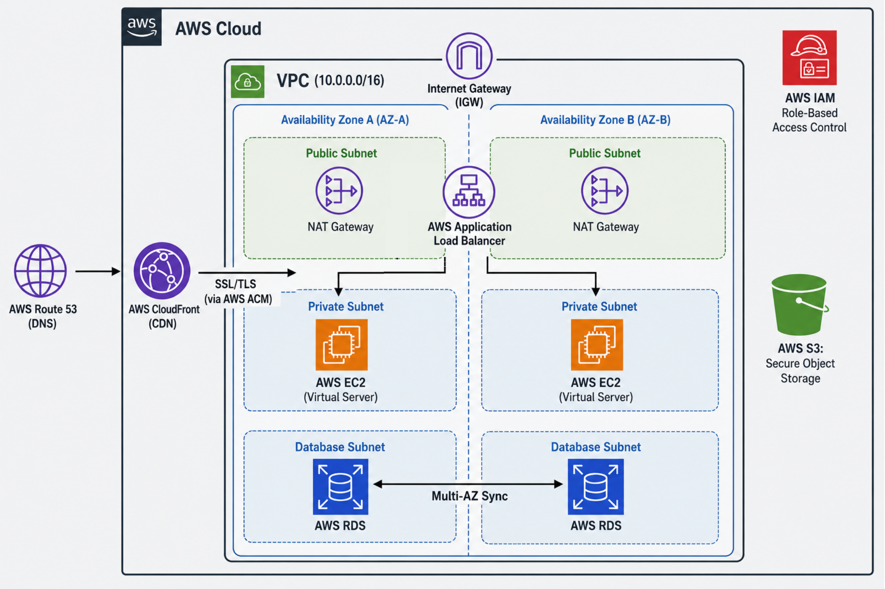

# CURE Distributed Digital Health Architecture
**Author:** [Moaz Ade]
**Live Production URL:** [https://d1efrh7ogcs9xx.cloudfront.net]

## Project Overview

This repository contains the architecture blueprint and deployment pipeline for CURE's digital health environment. The infrastructure was deliberately designed on AWS to prioritize **Network Isolation**, **High Availability**, and **Production Readiness**.

## Architecture & Network Topology Justification
As a network engineer, I architected the Virtual Private Cloud (VPC) with strict structural security in mind:

* **High Availability (Multi-AZ):** The infrastructure is distributed across two separate Availability Zones (eu-central-1a and 1b). The AWS RDS MySQL database is deployed in a Multi-AZ cluster to ensure synchronous replication and failover, satisfying the core availability requirement.
* **Network Isolation:** The EC2 application servers and RDS databases are locked deep inside **Private Subnets**. They have no public IP addresses and cannot be scanned from the inbound internet. 
* **Edge Proxy & SSL/TLS:** All public internet traffic is ingested globally via an **AWS CloudFront CDN** which enforces strict SSL/TLS encryption across all endpoints before forwarding traffic to the Application Load Balancer in the public subnet.
* **Secure Object Storage:** An AWS S3 bucket was provisioned with "Block All Public Access" enabled to securely handle static assets and backups.

## CI/CD Pipeline
The deployment is fully automated via GitHub Actions (`.github/workflows/deploy.yml`). Pushes to the mainline `main` branch trigger security scans, container assembly, and rolling deployments to the isolated EC2 fleet.
